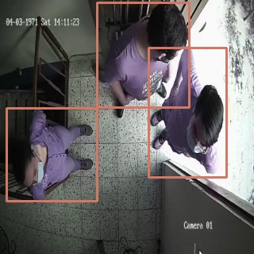

# demo_people_counter
Demo of a people counter using a camera capturing the top view of the person using Tensorflow, TF Object Detection API 2, TF Lite, Norfair, OpenCV

## Inspiration
The project is inspired and has used as basis the code in the following places:
* [People counter - Pyimagesearch](https://www.pyimagesearch.com/2018/08/13/opencv-people-counter/)
* [TF 2 Object Detection API Tutorial](https://tensorflow-object-detection-api-tutorial.readthedocs.io/en/latest/)
* [Norfair tracking library - Examples](https://github.com/tryolabs/norfair/tree/master/demos)

## Explanation
The project aims to count the people that goes in and out of a room by capturing the movement of a person through a camera placed in the ceiling.

* The person detection is made with an object detection model, specifically the [SSD Mobilenet 2 FPN](https://github.com/tensorflow/models/blob/master/research/object_detection/g3doc/tf2_detection_zoo.md) available in the TF 2 Model Zoo.
* The custom training was necessary to detect people from the top view. A [Colab notebook](https://colab.research.google.com/drive/1b7lN9LI2zQoZA_PZ4f7HHjJr8pyPrfeV?usp=sharing) was made to incorporate the training part and use the free GPU available.
* The model was selected because was appropiate to test its performance before creating a model that can be converted to TF Lite format and later to an Edge TPU compatible model. A notebook to convert the TF 2 OD API model to TF Lite and compile it later to be Edge TPU compatible can be found [here](https://colab.research.google.com/drive/1_1ZBulkZyp9kClylHT01QhKbc3dM2QQa?usp=sharing). This step is to deploy the model in an embedded system.
* The tracking function was implemented using the Norfair library.

After assigning an ID to a detection and tracking it throug several frames, its direction and position help to determine wheter the person has gone in or out.

# Results
* 
* 

## TO-DO
* Add detailed explanation to the notebooks
* Add a coral-edge tpu demo script
